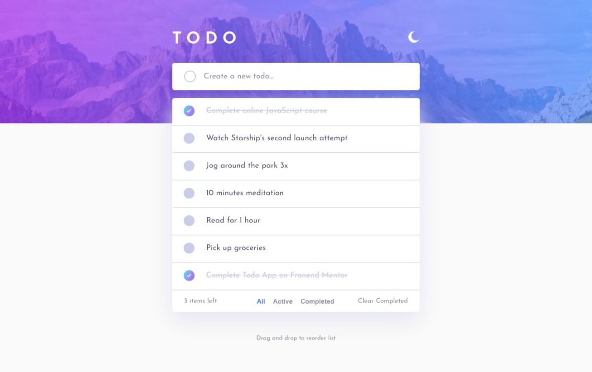
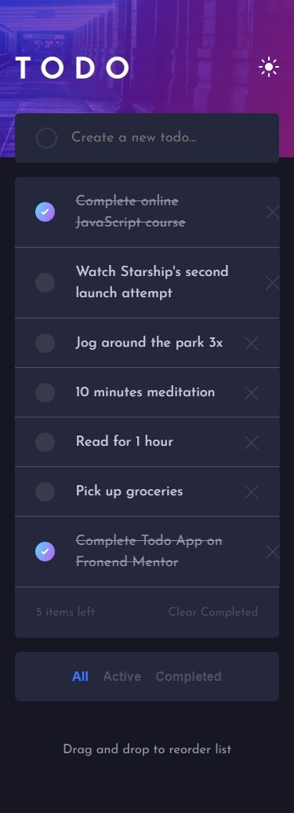
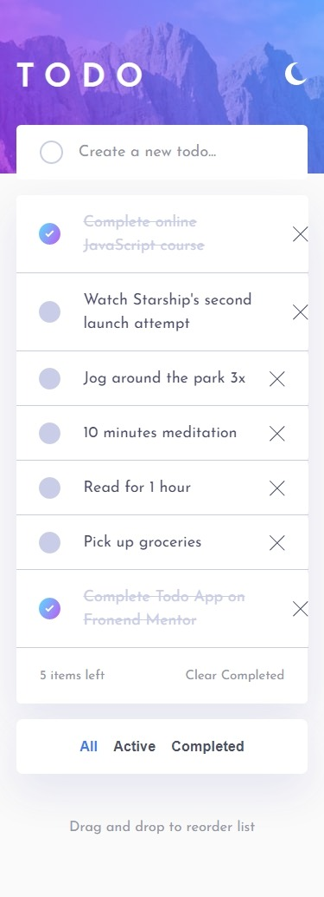

# Frontend Mentor - Todo app solution

This is a solution to the [Todo app challenge on Frontend Mentor](https://www.frontendmentor.io/challenges/todo-app-Su1_KokOW). Frontend Mentor challenges help you improve your coding skills by building realistic projects.

## Table of contents

- [Overview](#overview)
  - [The challenge](#the-challenge)
  - [Screenshot](#screenshot)
  - [Links](#links)
- [My process](#my-process)
  - [Built with](#built-with)
  - [What I learned](#what-i-learned)
  - [Useful resources](#useful-resources)
- [Author](#author)

## Overview

### The challenge

Users should be able to:

- View the optimal layout for the app depending on their device's screen size
- See hover states for all interactive elements on the page
- Add new todos to the list
- Mark todos as complete
- Delete todos from the list
- Filter by all/active/complete todos
- Clear all completed todos
- Toggle light and dark mode
- Drag and drop to reorder items on the list

### Screenshot

  
  

### Links

- Solution URL: [Add solution URL here](https://your-solution-url.com)
- Live Site URL: [Add live site URL here](https://your-live-site-url.com)

## My process

### Built with

- Semantic HTML5 markup
- CSS custom properties
- Flexbox
- CSS Grid
- SASS Preprocessor
- JavaScript
- [React](https://reactjs.org/) - JS library

### What I learned

Creating a drag-and-drop page was a completely new experience for me, but it proved to be both interesting and challenging. Throughout the process of building this application, I gained a lot of valuable knowledge and had an enjoyable time doing it.

### Useful resources

- [Web Dev Simplified](https://www.youtube.com/watch?v=jfYWwQrtzzY&list=PL8m3Xga6j2RanhVCzPHP-tlZyN0qimjZX&index=156) - I attempted to create the drag-and-drop feature independently, but encountered a roadblock. Fortunately, a tutorial video I found was immensely helpful in overcoming the challenge. I highly recommend this YouTube channel, which provides exceptional tutorials on a diverse range of technologies. Don't hesitate to check it out for yourself!

## Author

- Website - [Fernando Rojas](https://portfoliio-three.vercel.app)
- Frontend Mentor - [@DF27ARTS](https://www.frontendmentor.io/profile/DF27ARTS)
- Twitter - [@\_DF_Fernando](https://twitter.com/_DF_Fernando)
